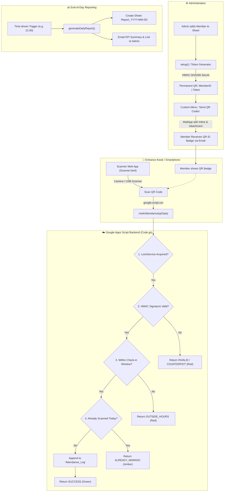

# 🏢 Workstation Attendance System (QR-Based Check-in)

A complete, production-grade Workstation Attendance System powered by **Google Apps Script** bound to a **Google Sheet** with a mobile-responsive **HTML5 QR Scanner Web App**.

---

## 📌 Architecture & Workflow



---

## 📂 Project Structure

```
d:\Workstation Attendance system\
├── appsscript.json        # Manifest file with Asia/Kolkata timezone & scopes
├── Code.gs                # Complete backend logic (HMAC, Sheets, MailApp, Reports)
├── Scanner.html           # Modern glassmorphism Web App with HTML5-QRCode & Web Audio
├── sample_members.csv     # Sample CSV format with 5 dummy members
└── README.md              # Complete setup and operational guide
```

---

## 🚀 Step-by-Step Setup Instructions

### Step 1: Create a Google Spreadsheet
1. Open [Google Sheets](https://sheets.new) in your browser.
2. Name your spreadsheet: **Workstation Attendance System**.

---

### Step 2: Open Apps Script & Add Files
1. In your Google Sheet, go to **Extensions** &rarr; **Apps Script**.
2. Rename the project at top-left to: **Workstation Attendance System**.
3. **Enable Manifest File**:
   - Click the **Gear icon** (Project Settings) on the left sidebar.
   - Check the box: `Show "appsscript.json" manifest file in editor`.
4. **Copy `appsscript.json`**:
   - Return to the **Editor** (`<>` icon).
   - Click `appsscript.json` and replace all its contents with the code from [`appsscript.json`](file:///d:/Workstation%20Attendance%20system/appsscript.json).
5. **Copy `Code.gs`**:
   - Open `Code.gs` in the editor.
   - Replace its entire contents with the code from [`Code.gs`](file:///d:/Workstation%20Attendance%20system/Code.gs).
6. **Add `Scanner.html`**:
   - Click the **`+`** icon next to *Files* &rarr; Select **HTML**.
   - Name the file `Scanner` (Apps Script automatically appends `.html`).
   - Paste the code from [`Scanner.html`](file:///d:/Workstation%20Attendance%20system/Scanner.html).
7. Press `Ctrl + S` (or `Cmd + S`) to save all files.

---

### Step 3: Run System Initialization (`setup`)
1. In the Apps Script toolbar, ensure the function dropdown is set to **`setup`**.
2. Click **Run**.
3. **Grant Google Permissions**:
   - When the *"Authorization required"* modal appears, click **Review permissions**.
   - Choose your Google account.
   - Click **Advanced** &rarr; Click **Go to Workstation Attendance System (unsafe)**.
   - Click **Allow**.
4. Once `setup` finishes execution:
   - Return to your Google Spreadsheet tab and refresh the page.
   - You will see 3 sheets created and styled:
     1. **`Members`**: Pre-filled with 5 sample members, tokens, and QR links.
     2. **`Attendance_Log`**: Ready to record check-in events.
     3. **`Config`**: Pre-filled with workstation settings.
   - A new custom menu **🏢 Workstation Attendance** will appear in the top menu bar.

---

### Step 4: Deploy the Scanner Web App
1. In the top-right corner of Apps Script, click **Deploy** &rarr; **New deployment**.
2. Click the gear icon next to *Select type* &rarr; Choose **Web app**.
3. Configure the deployment:
   - **Description**: `Workstation Scanner v1.0`
   - **Execute as**: `Me (<your-email@gmail.com>)`
   - **Who has access**: `Anyone` *(or "Anyone within your organization" if using Google Workspace)*.
4. Click **Deploy**.
5. Copy the **Web app URL** (ends in `/exec`).
   > 💡 **Tip:** Bookmark this URL on your tablet or smartphone kiosk at the workstation entrance.

---

## 📋 Features & How to Use

### 1. Sending QR Badges to Members (`Feature 1`)
1. Open the Google Sheet &rarr; Click menu **🏢 Workstation Attendance** &rarr; **📧 Send QR Codes to Members**.
2. **Standard Gmail vs High Volume (Same-Day 300+ emails)**:
   - **Gmail (Default)**: Free Google accounts send up to 100 emails/day.
   - **Brevo API (300 Free/Day)** or **Resend (3,000 Free/Month)**:
     - Click **🏢 Workstation Attendance** &rarr; **⚡ Email Provider Setup (Brevo / Resend / Gmail)**.
     - Select **Brevo** or **Resend**, paste your free API key, and click **Save Settings**.
     - Now you can send 300+ emails in a single click in one day without hitting Gmail quota limits!
3. **Alternative: Export All QR Badges to Google Drive**:
   - Click **🏢 Workstation Attendance** &rarr; **📁 Export All QR Badges to Google Drive**.
   - Generates individual PNG badges (`WS-001_Aarav_Sharma.png`) inside a new Google Drive folder for instant ZIP download or WhatsApp sharing.

### 2. Adding New Members
1. Go to the **`Members`** sheet.
2. Add a new row:
   - Column A: `WS-006`
   - Column B: `Member Name`
   - Column C: `member.email@example.com`
   - Leave `Token` and `QR Link` blank; set `Email Sent` to `No`.
3. Click **🏢 Workstation Attendance** &rarr; **🚀 Initialize / Refresh System Setup**.
4. The system will automatically compute the cryptographic HMAC token and QR code URL for the new member!
5. Click **📧 Send QR Codes to Members** to dispatch their pass.

### 3. Using the Scanner Web App (`Feature 2 & 3`)
- Open the Web App URL on any smartphone, iPad/tablet, or laptop webcam.
- **Camera Scanning**: Present the QR code on the phone screen or printed card within the reticle.
- **Audio Feedback**: The scanner chirps with a high chime for success, warning double-beep for duplicate scans, and a buzz tone for errors.
- **Result Screen**:
  - 🟢 **Green ("Welcome, [Name]!")**: Check-in logged with timestamp.
  - 🟠 **Amber ("[Name], already marked present today")**: Duplicate scan prevented.
  - 🔴 **Red ("Outside Check-in Window" / "Invalid QR")**: Access denied.
- **Auto-Reset**: Resets back to continuous scanning in 3 seconds.
- **USB Scanner / Manual Fallback**: Connect a USB handheld barcode reader or type `WS-001|<token>` into the input box below the camera.

### 4. End-of-Day Daily Attendance Report (`Feature 4`)
- **Automated Scheduling**:
  1. Click **🏢 Workstation Attendance** &rarr; **⏰ Setup Daily Report Trigger**.
  2. The system reads the `Report Generation Time` from `Config` (e.g., `21:00`) and automatically runs at that hour every evening.
  3. It generates a new sheet **`Report_YYYY-MM-DD`**, color-codes Present (Green) vs Absent (Red), and emails the summary KPI to the `Admin Email`.
- **Manual Generation**:
  - Click **🏢 Workstation Attendance** &rarr; **📊 Generate Today's Report** anytime to produce today's report on demand.

---

## ⚙️ Configuration Options (`Config` Sheet)

| Setting | Default | Description |
|---|---|---|
| **Workstation Name** | `Main Innovation Lab` | Displayed in Web App header, emails, and reports |
| **Check-in Start Time** | `08:00` | Earliest allowed scan time (HH:mm 24-hr format) |
| **Check-in End Time** | `20:00` | Latest allowed scan time (HH:mm 24-hr format) |
| **Report Generation Time** | `21:00` | Trigger hour for automated daily report & email |
| **Admin Email** | `admin@example.com` | Receives end-of-day summary reports |
| **Allowed Re-scan** | `No` | Set to `Yes` if members need to scan multiple times/day |

---

## 🖨️ Entrance Poster / QR Signage Guide

To set up a self-service check-in station at the workstation entrance:

1. **Kiosk Tablet Setup**:
   - Mount a tablet or old smartphone on a stand at the entrance.
   - Open the deployed Web App URL in full-screen (Chrome &rarr; *Add to Home Screen* for a clean kiosk mode).
2. **Entrance Poster (Alternative)**:
   - Generate a QR code linking to your Web App URL.
   - Print a sign: *"Scan here to check in with your Workstation QR"* and place it at the front desk.

---

## 🔒 Security & Anti-Counterfeiting Details

- **Cryptographic Signing**: Each token is calculated using `HMAC-SHA256(MemberID, SecretKey)`.
- **Protected Secret**: The `HMAC_SECRET_KEY` is stored in Google Apps Script `ScriptProperties` (never exposed to client-side code or spreadsheet viewers).
- **Concurrency Protection**: Check-in transactions utilize `LockService.getScriptLock()` to prevent race conditions when multiple members scan simultaneously.

---

## 🛠️ Troubleshooting & FAQs

### Q1: The camera shows a black screen or "Camera Access Blocked".
- **Cause**: Google Apps Script's editor test preview embeds the page inside a sandboxed `iframe` without camera permissions.
- **Fix**: Open the standalone Web App URL (`https://script.google.com/macros/s/.../exec`) directly in Chrome or Safari and click **Allow** on the camera permission prompt.

### Q2: How do I change the Timezone?
- Open `appsscript.json` and verify `"timeZone": "Asia/Kolkata"`. You can change this to any valid tz database string (e.g. `America/New_York`, `Europe/London`). Also update `SCRIPT_TIMEZONE` in `Code.gs`.

### Q3: Daily Email Quota
- Free Google accounts (@gmail.com) have a quota of **100 emails/day**.
- Google Workspace accounts have a quota of **1,500 emails/day**.
- The script checks `MailApp.getRemainingDailyQuota()` and skips sending if the quota is reached.
